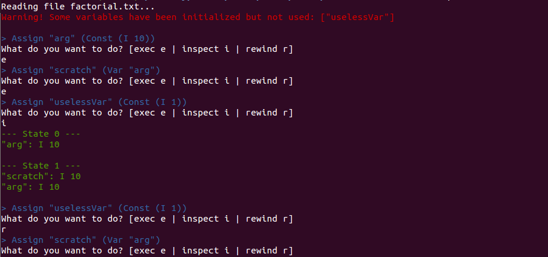

# :clock1: Haskell Reversible Interpreter

This is the 2nd assignment for CS4012 (Topics in Functional Programming). The goal was to develop a reversible interpreter for a small language using Monads.

My information is:

|Name             |Student ID|Status|
|-----------------|:--------:|:--------:|
|Benoit Chabod    |16336617  |Erasmus  |

## a) Usage

This application has been built using **Stack**. To compile the project, just type:

```
stack build
```

And then, to run it, just type:

```
stack exec interpreter
```

The source file used by the interpreter is [factorial.txt](factorial.txt), but feel free to test your own program (and modify [Main.hs](src/Main.hs) accordingly). The source file has to contain a derived Read instance (that can be produced using Show) to be parsed properly.

There are three commands available in the interpreter:

- **e** for exec, that runs the current statement
- **i** for inspect, that shows the content of the variables and the whole program history
- **r** for rewind, that moves the program back by one statement

Here's a screenshot of the interpreter in action:



## b) Work accomplished

Regarding each section of the subject:

1. The project has been converted to Stack and is easy to build — **[100%]**
2. The interpreter reads the program in a file and executes it statement by statement — **[100%]**
3. One can inspect the content of all the variables — **[100%]**
4. One can inspect the history of the program (and the modifications of each variable through the execution) — **[100%]**
5. There's a "step backwards" (called rewind here) operation that allows the user to move the program back — **[100%]**
6. I've added some static analysis, the interpreter will warn the user if some variables have been initialized but aren't used later in the program — **[100%]**

So every part of the assignment has been completed, although the UI of the interpreter could be improved (fixed menu in the terminal, history by variable, etc).
